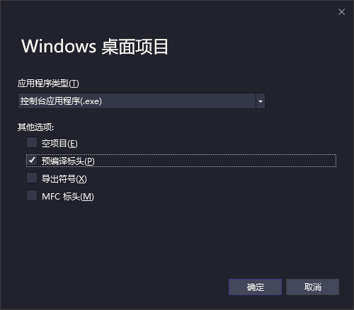
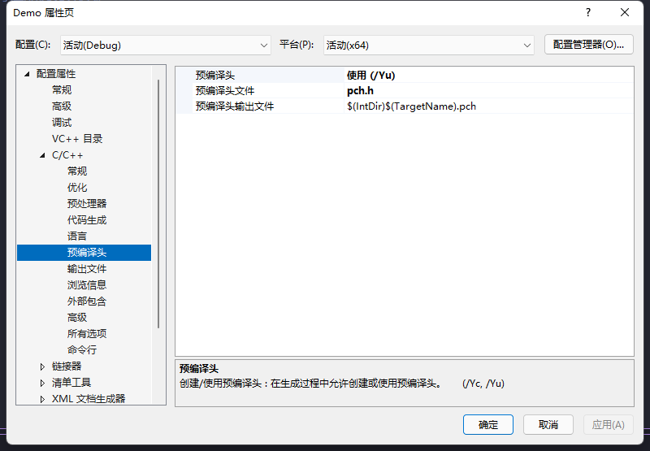

# C1083

## 参考

+ [MSDN](https://learn.microsoft.com/zh-cn/cpp/error-messages/compiler-errors-1/fatal-error-c1083?view=msvc-140)

---
# 情况

```
无法打开预编译头文件 "*.pch" No such file or directory
```
> *——别人给你的东西不能随便要，微软给你的东西不能随便丢*
---
## 原因

+ 来自创建VC项目时选择了预编译的头文件    

       

    VC项目会自动生成一个.pch文件用于全局引用，在编译的时候添加到编译器指令中，因而删除该文件会发生异常。

## 解决方案
这是一个VC项目的配置,解决方案有两种：   
1. 右键项目进入属性页，  选择 `C/C++` > `预编译头` 将 `预编译头` 选项更改为 `不使用` 或者 `创建`
    
2. 直接按照要求的文件名在项目 `根目录` 创建一个文件，里面写啥无所谓


---
# 想要[返回](../README.md)?