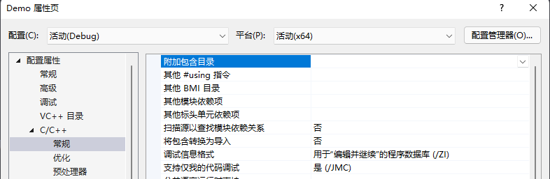

# LNK2001
```
无法解析的外部符号 “symbol”
```
> *"symbol"你人呢？ 你根本不在项目里面！*
## 参考
+ [MSDN](https://learn.microsoft.com/zh-cn/cpp/error-messages/tool-errors/linker-tools-error-lnk2001?view=msvc-140)

---
# 情况

## 原因
+ 你正在引用某个函数，或者某个变量，而他们并没有被正确的导入

## 解决方案
+ 请查询你的引用来自哪一个文件，然后正确的导入他们 

+ 如果你正在使用 `外部依赖` 进行构建，[LNK2001](#lnk2001) 往往因为没有正确的导入头文件，如果你导入头文件`#include <>` 报红，那么一定是因为这个原因。   
    你可以尝试使用 `绝对路径`
    ``` c++
    #include "disk:/directory/head.h"
    ```
    或者将头文件的目录添加到项目配置中 `属性` > `C/C++` > `常规` > `附加包含目录`   
       
    通过 `宏` 来快速的定位到相对路径，如果你已经将这些头文件移动到项目目录的某处，常用的有：
    ``` sh 
    ${ProjectDir}  ${ProjectName} ...
    ```
    来组成某个相对目录
    ``` sh
    ${Project}Include/  =>  盘符:前置的目录/项目目录/Include/
    ```
    届时，你的 `#include<>` 报红会消失


## 你的下一个问题也许是 [LNK2019](../LNK2019/README.md) ?

---
# 想要[返回](../README.md)?