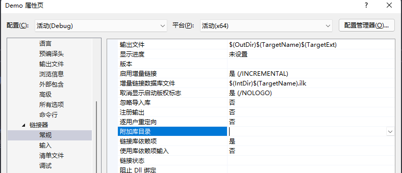
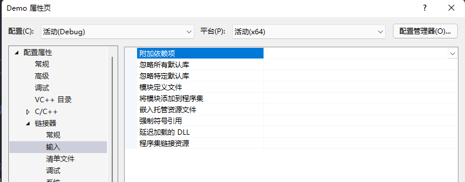
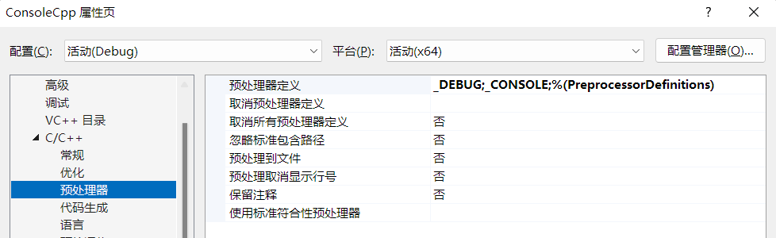
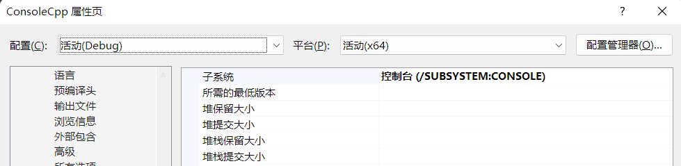

# LNK2019
```
无法解析的外部符号 “symbol”， 函数 "function" 中引用了该符号
```
> *头文件有了，但是库呢？*

## 参考

+ [MSDN](https://learn.microsoft.com/zh-cn/cpp/error-messages/tool-errors/linker-tools-error-lnk2019?view=msvc-140)

# 情况

## 可能的原因
1. 如果对于外部引用的函数，这是由于函数的实现缺失而导致的   
    ### 解决方案
    +  将库目录添加到项目配置中 `属性` > `链接器` > `常规` > `附加库目录`   
        通过 `宏` 来快速的定位到相对路径，如果你已经将这些 `库` 移动到项目目录的某处，常用的有：
        ``` sh 
        ${ProjectDir}  ${ProjectName} ...
        ```
        来组成某个相对目录
        ``` sh
        ${Project}lib/  =>  盘符:前置的目录/项目目录/lib/
        ```
           

    + 以及配置你需要引用到的 `库` 如 `mscorlib.dll` 、 `Kernel32.lib` （用 `;` 号分隔他们）
            
        如果你无法确定哪一些库是你所用到的，请询问他们提供的 `开发文档` 或者 `带你入坑` 的人，或者...    
        **`把所有库全部导入进去`**   

2.  某些特殊的情况  
    如果你的报错提示为
    ``` 
    无法解析的外部符号 _WinMain@16，该符号在函数 ___tmainCRTStartup 中被引用
    ```
    这很可能是因为你的 `程序入口(main)` 出错而导致的  
    你新建了一个 `控制台应用程序` ，但在 `.cpp` 文件中提供了 Windows入口函数 `WinMain` 
    
    ### 解决办法
    + 请检查你的 右键项目 > `属性` > `C/C++` > `预处理器` > `预处理器定义` 配置是否正确 (`_CONSOLE`/`_WINDOWS`)

        

    + 以及 右键项目 > `属性` > `配置属性` > `链接器` > `系统`  > `子系统`> 设置为  控制台 (`/SUBSYSTEM:CONSOLE`)
        

        > *如果你无法看到这个配置内容，清在下拉框`配置(C)`和`平台(P)`中选择某项*

    + 如果依然无法解决 ， 请新建一个你需要的 `项目`
    

## 你也许正寻找 [LNK2001](../LNK2001/README.md) ?

---

# 想要[返回](../README.md)?